# EmployeeOS Mobile

EmployeeOS Mobile is a Flutter app that centralizes internal workflows such as communication, recruitment, and productivity into one mobile experience.

## Table of Contents

- [About the Project](#about-the-project)
- [Key Features](#key-features)
- [Screenshots and Media](#screenshots-and-media)
- [Technologies Used](#technologies-used)
- [Setup and Installation](#setup-and-installation)
- [Project Approach](#project-approach)
- [Project Status](#project-status)
- [Credits](#credits)
- [License](#license)

## About the Project

EmployeeOS is designed as an internal operating layer for employees and admins.  
The app helps teams access core work modules quickly, stay aligned, and manage operational tasks from a single mobile interface.

## Key Features

- Secure authentication and role-aware access.
- Modular dashboard for quick navigation to business tools.
- Chat and communication pages for collaboration.
- Recruitment and job posting workflows.
- File manager support for work-related documents.
- Scalable routing architecture for cleaner navigation and maintenance.

## Screenshots and Media

### Mobile app screenshots:

### UI & Dashboard

<p align="start">
  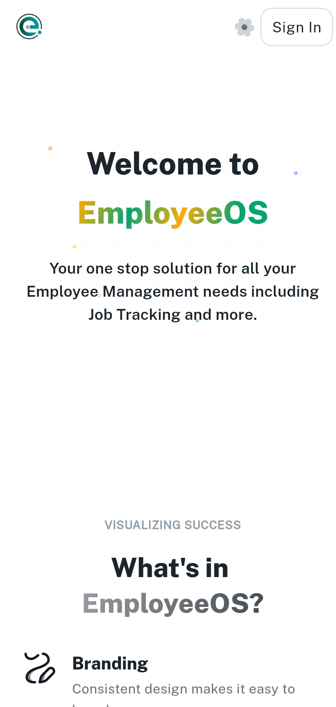
  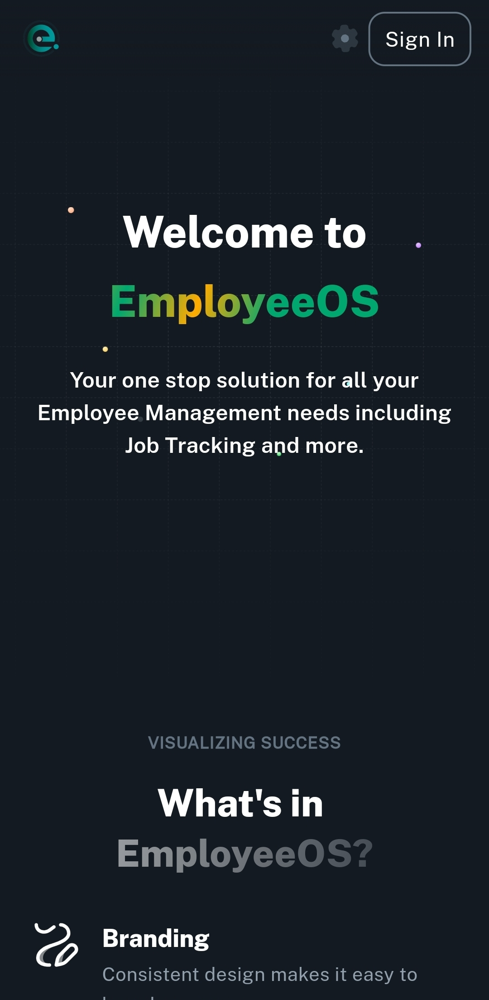
  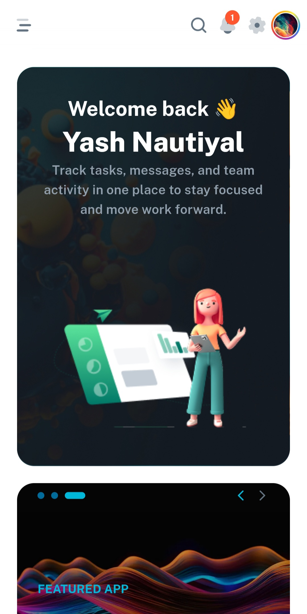
  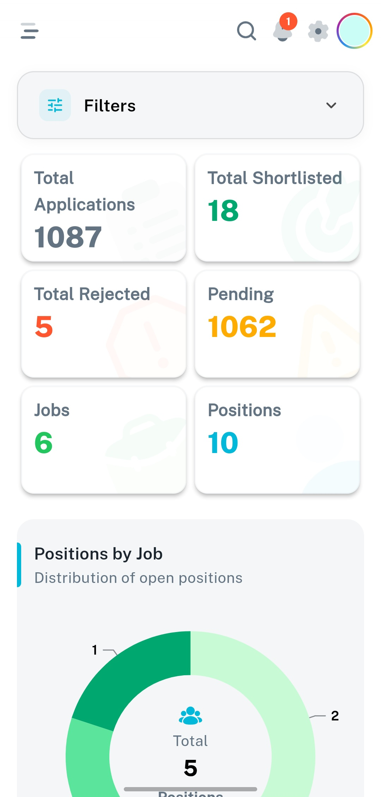
  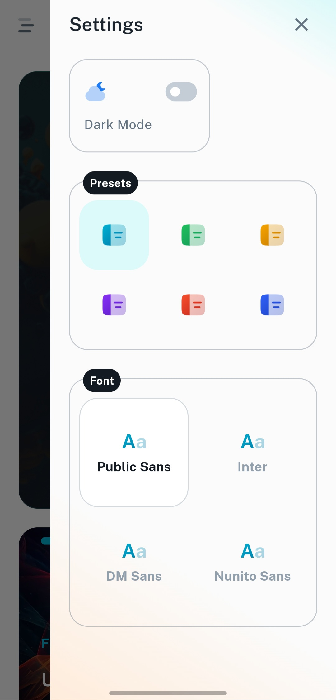

</p>

### Hiring Pipeline

<p align="center">
  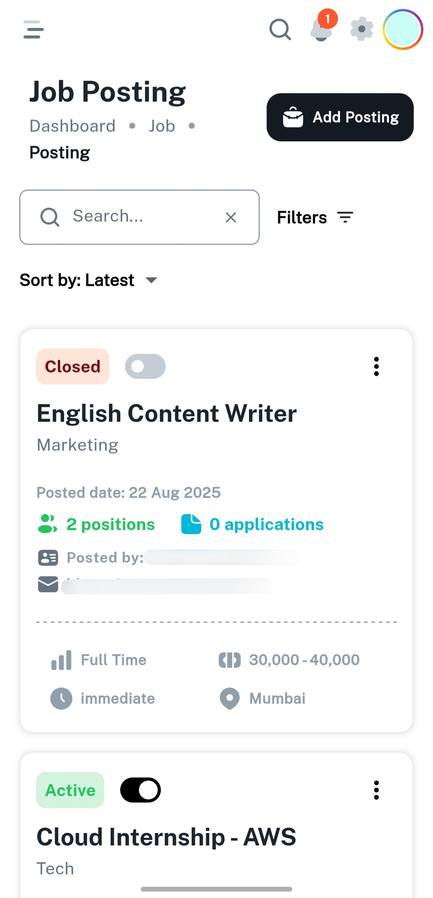
  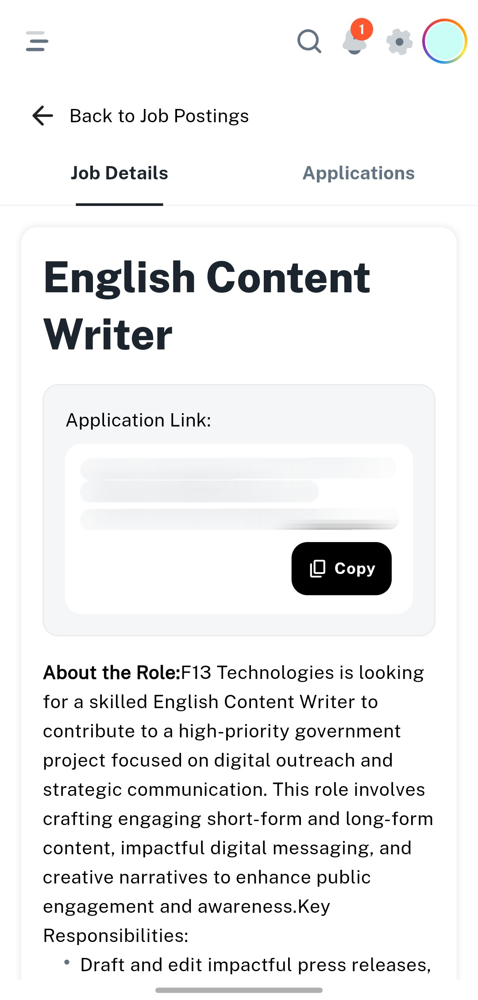
  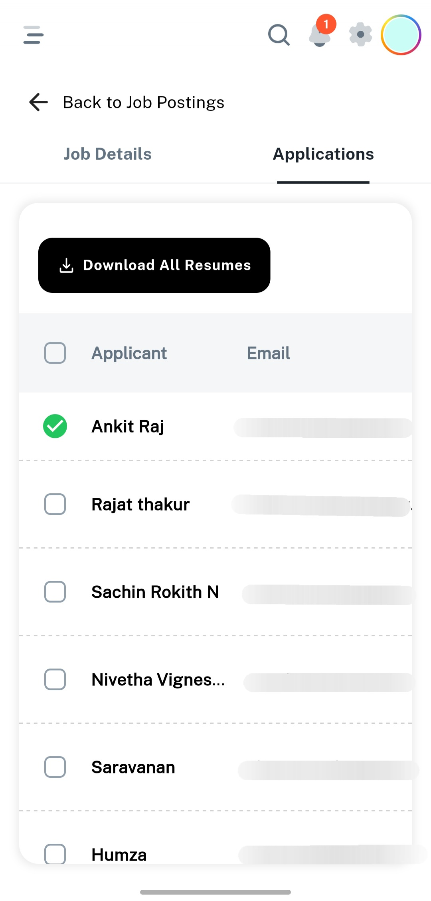
  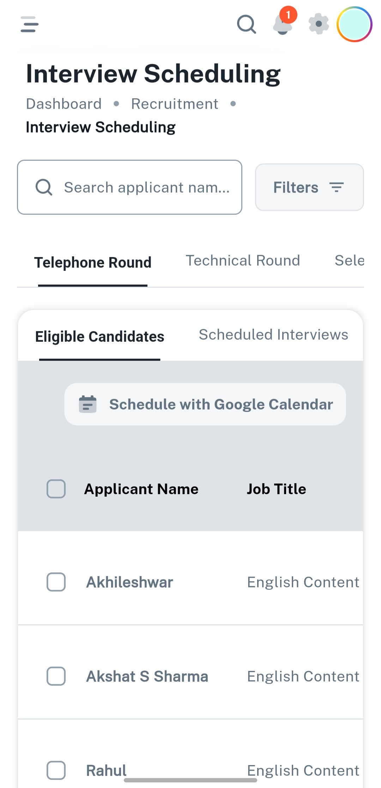
</p>

### Other Services

<p align="center">
  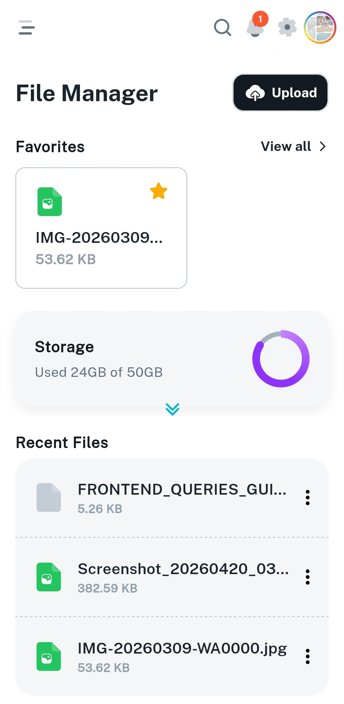
  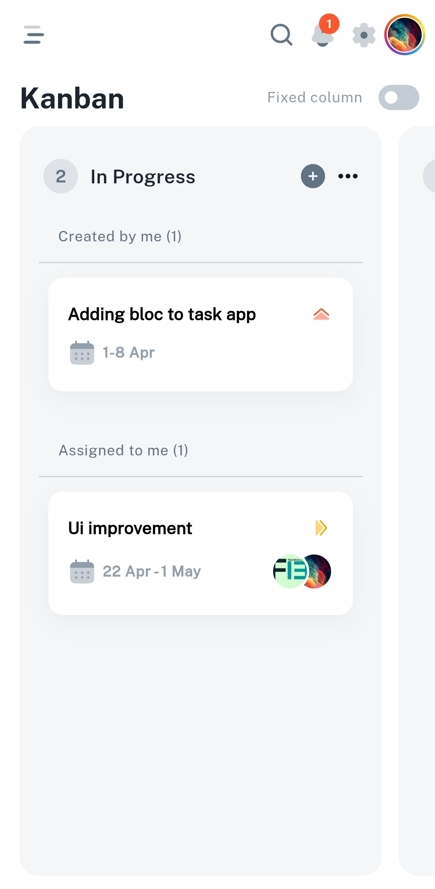
  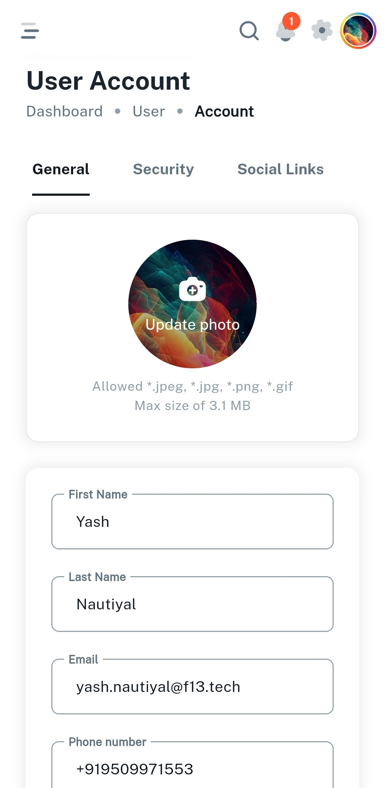
</p>

## Technologies Used

- Flutter
- Dart
- Feature-based modular architecture
- Centralized route management (go_router: ^14.8.1)

## Setup and Installation

### Prerequisites

- Flutter SDK
- Android Studio / VS Code
- Emulator or physical device

### Run Locally

```bash
flutter pub get
flutter run
```

## Project Approach

The project follows a feature-first structure with clear separation between presentation, domain, and data layers.  
Routing and navigation are centralized to keep flows predictable as modules grow.

## Project Status

In active development.

## Credits

UI direction inspired by MUI Minimal Dashboard: [Minimal - Client and Admin Dashboard](https://mui.com/store/items/minimal-dashboard/)

## License

This project is currently private/internal.  
