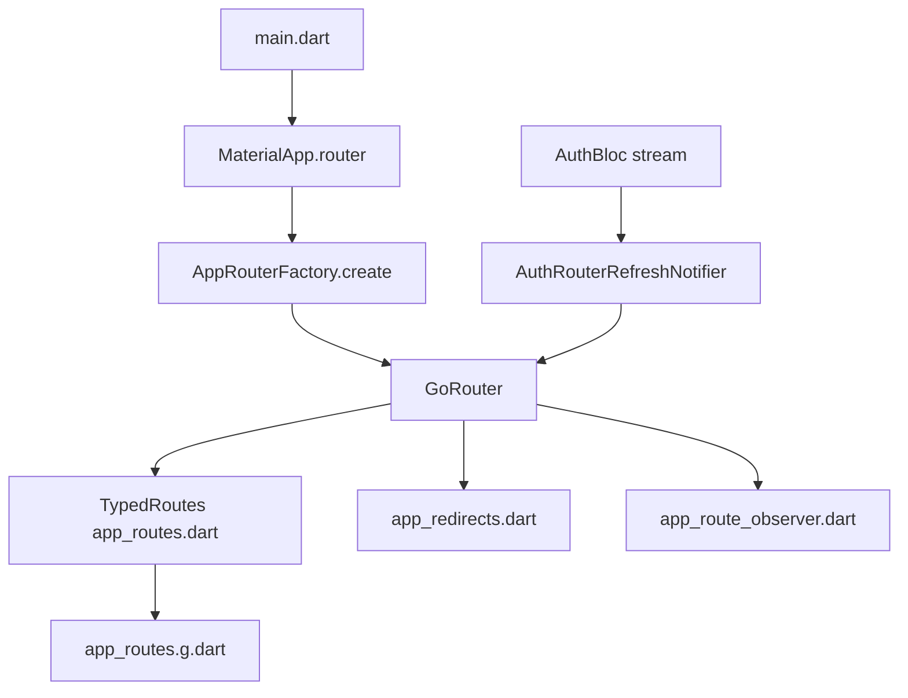

# go_router Setup Guide

This guide explains the routing architecture used in this project and how to initialize it in a new Flutter app.

## Routing Mental Model

## What each routing file does

- `lib/core/routing/app_routes.dart`: source of truth for typed route classes.
- `lib/core/routing/app_routes.g.dart`: generated route wiring. Never edit manually.
- `lib/core/routing/app_router.dart`: creates the `GoRouter` instance and connects routes, redirects, observers.
- `lib/core/routing/app_redirects.dart`: centralized auth/role redirect rules.
- `lib/core/routing/auth_router_refresh_notifier.dart`: triggers router reevaluation when auth changes.
- `lib/core/routing/app_route_observer.dart`: navigation observer for logging/analytics hooks.

## Initial setup steps (new project)

1. Add dependencies in `pubspec.yaml`:
   - `go_router`
   - `go_router_builder` (dev dependency)
   - `build_runner` (dev dependency)
2. Create route classes in `app_routes.dart` using `@TypedGoRoute`.
3. Add `part 'app_routes.g.dart';` in `app_routes.dart`.
4. Run codegen:
   - `dart run build_runner build --delete-conflicting-outputs`
5. Build `GoRouter` in `app_router.dart`.
6. Use `MaterialApp.router(routerConfig: ...)` in `main.dart`.
7. Add redirect rules and route observer.

## If you do not want build_runner

You can use `go_router` directly with manual `GoRoute` definitions:

- Pros: simpler toolchain, no code generation step.
- Cons: more string-based navigation, weaker compile-time safety for params and paths.

Use this style only when the app is very small or short-lived. For long-lived apps, typed routes are safer.

## Useful commands

- Generate routes: `dart run build_runner build --delete-conflicting-outputs`
- Regenerate continuously: `dart run build_runner watch --delete-conflicting-outputs`
- Check analysis: `dart analyze`
