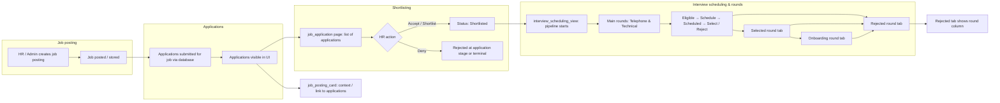
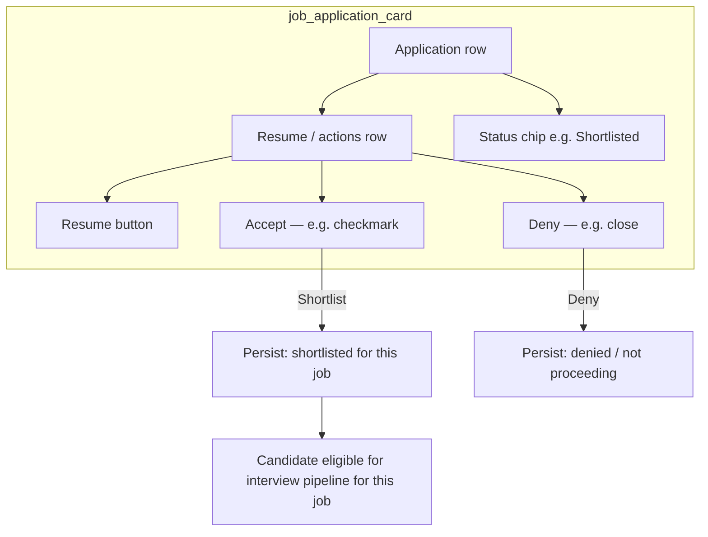
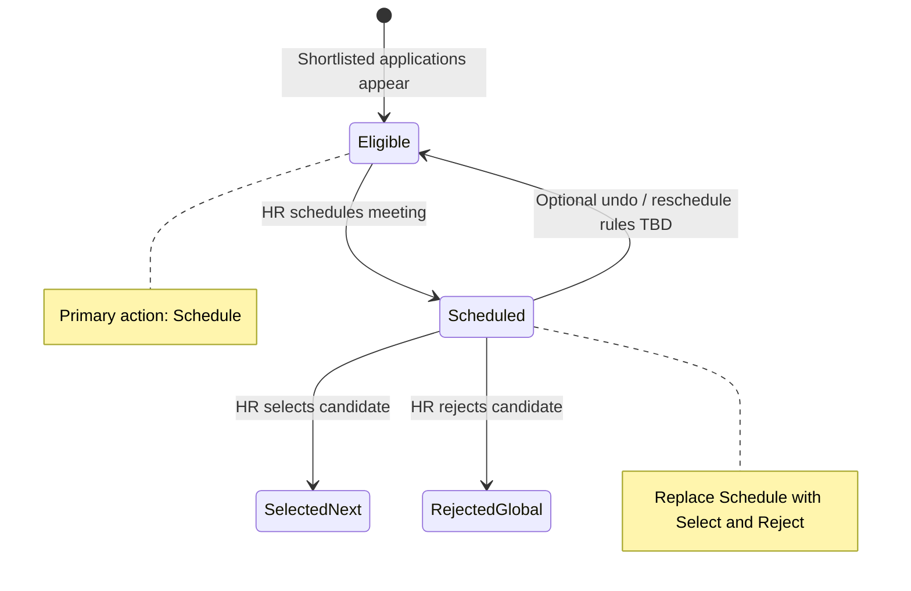
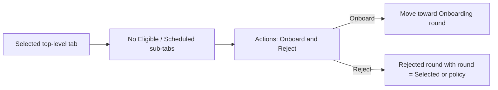
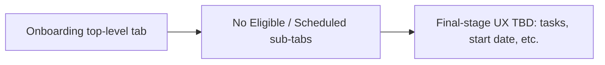
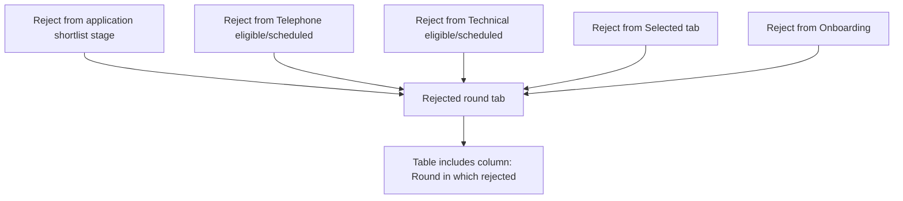

# Recruitment & interview workflow (design reference)

This document captures the **intended end-to-end flow** for job postings → applications → shortlisting → interview scheduling → rounds → onboarding / rejection. It is meant for **review before** implementing clean-architecture wiring (repositories, use cases, blocs, UI).

**Related enums:** `lib/view/recruitment/domain/interview_scheduling/entities/interview_enums.dart`

- **Interview rounds (top-level tabs):** `telephone`, `technical`, `onboarding`, `selected`, `rejected`
- **Candidate sub-tabs (only for main interview rounds):** `eligible`, `scheduled`

---

## 1. End-to-end flow (high level)



---

## 2. Application layer (job application card)



**Note:** Exact persistence fields (e.g. `application_status`, `shortlisted_at`) will be defined when mapping to the database layer.

---

## 3. Interview scheduling UI hierarchy (target behavior)

**Rule:** Inner tabs **Eligible | Scheduled** apply **only** to **main rounds** (`Telephone`, `Technical`). They **do not** appear for **additional** rounds (`Onboarding`, `Selected`, `Rejected`).

```mermaid
flowchart TB
  subgraph top["Top-level round tabs InterviewRound"]
    T1[Telephone]
    T2[Technical]
    T3[Onboarding]
    T4[Selected]
    T5[Rejected]
  end

  subgraph main["Main rounds only"]
    T1 --> ST1[Sub-tabs: Eligible | Scheduled]
    T2 --> ST2[Sub-tabs: Eligible | Scheduled]
  end

  subgraph additional["Additional rounds — no Eligible/Scheduled sub-tabs"]
    T3 --> UI3[Single layout: table / actions as designed]
    T4 --> UI4[Single layout: Onboard + Reject — no inner tabs]
    T5 --> UI5[Table + extra column: Round rejected in]
  end
```

---

## 4. Main rounds (Telephone & Technical) — eligible vs scheduled

Same pattern for **both** main rounds.



**Eligible tab**

- Lists applicants who are **in this round** and **not yet scheduled** (or per your product rules).
- Primary action: **Schedule** (opens scheduling flow / meet).

**Scheduled tab**

- Lists applicants with a **scheduled** interview for this round.
- Actions: **Select** and **Reject** (not Schedule).

---

## 5. Selected round tab (no inner tabs)



---

## 6. Onboarding round tab



Candidates reach onboarding after being **selected** and **onboard** action (or equivalent) from the **Selected** tab.

---

## 7. Rejected round tab (aggregate + round column)

Any rejection from **any stage** that should appear in the global “rejected” view lands here.



The **round** value should be explicit (e.g. `application`, `telephone`, `technical`, `selected`, `onboarding`) so HR can see **where** the candidate left the pipeline.

---

## 8. Summary matrix (for implementation planning)

| Top-level round | Inner tabs (Eligible \| Scheduled) | Primary UX                                       |
| --------------- | ---------------------------------- | ------------------------------------------------ |
| Telephone       | Yes                                | Eligible → Schedule; Scheduled → Select / Reject |
| Technical       | Yes                                | Same as Telephone                                |
| Selected        | No                                 | Onboard / Reject                                 |
| Onboarding      | No                                 | Onboarding workflow                              |
| Rejected        | No                                 | Table + **Round** column                         |

---

## 9. Next steps (after you review this doc)

1. Align **data model** (application status, round, scheduled interview records, rejection reason + `rejected_in_round`).
2. Define **clean architecture** slices: domain entities, repository contracts, data sources (remote/DB), use cases per action (shortlist, deny, schedule, select, reject, onboard).
3. Map **bloc events/states** for `job_application` and `interview_scheduling` to the flows above.
4. Refactor **interview_scheduling_view** so `_candidateTabController` (Eligible/Scheduled) is **only** built when `activeRound` is `telephone` or `technical`.

---

## Document history

- **v1** — Flowcharts from product discussion; UI rules for sub-tabs and rejected round column.
